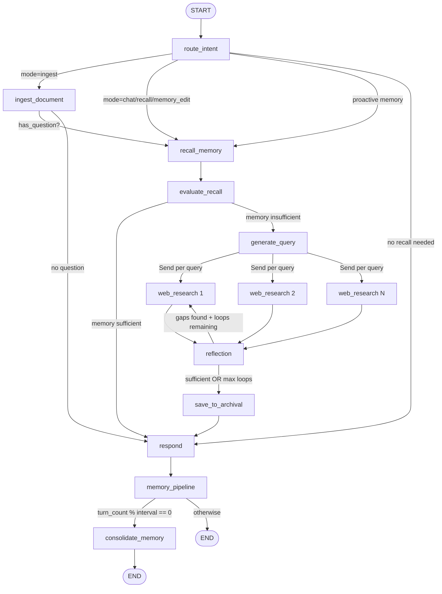

# LangGraph Flow Detail

The Knowledge Agent is implemented as a LangGraph `StateGraph` with conditional edges. This document details every node, edge, and routing decision.

## Graph Definition

Defined in `backend/src/agent/graph.py`. The graph is compiled with `builder.compile(name="knowledge-agent")`.

## Node Overview

| Node | Source File | Purpose |
|------|-----------|---------|
| `route_intent` | `nodes/memory_manager.py` | Classify user intent into mode |
| `recall_memory` | `nodes/memory_manager.py` | Search archival + recall memory |
| `evaluate_recall` | `nodes/memory_manager.py` | Judge if memory is sufficient |
| `generate_query` | `nodes/researcher.py` | Generate search queries |
| `web_research` | `nodes/researcher.py` | Execute web search (parallel via Send) |
| `reflection` | `nodes/researcher.py` | Evaluate research completeness |
| `ingest_document` | `nodes/memory_manager.py` | Process and store documents |
| `save_to_archival` | `nodes/memory_manager.py` | Save research findings |
| `respond` | `nodes/responder.py` | Generate final response |
| `memory_pipeline` | `nodes/memory_pipeline.py` | Extract facts from conversation |
| `consolidate_memory` | `nodes/memory_pipeline.py` | Periodic memory consolidation |

## Complete Flow Diagram



## Conditional Edge Logic

### `route_after_intent(state)` - After route_intent

```python
if mode == "ingest":
    return "ingest_document"
if mode in ("chat", "memory_edit") or not need_recall:
    # Proactive memory: route early chat turns through recall_memory
    if proactive_memory_enabled and turn_count < proactive_memory_turns:
        return "recall_memory"
    return "respond"
return "recall_memory"
```

### `route_after_evaluation(state)` - After evaluate_recall

```python
if memory_sufficient:
    return "respond"       # Memory has enough context
return "generate_query"    # Need web research
```

### `continue_to_web_research(state)` - After generate_query

Uses LangGraph `Send` to fan out: one `web_research` node per generated query. This enables parallel execution.

### `evaluate_research(state)` - After reflection

```python
if is_sufficient or loop_count >= max_loops:
    return "save_to_archival"
if follow_up_queries:
    return [Send("web_research", q) for q in follow_up_queries]
return "save_to_archival"
```

### `route_after_pipeline(state)` - After memory_pipeline

```python
if turn_count > 0 and turn_count % consolidation_interval == 0:
    return "consolidate_memory"
return END
```

## Intent Modes

| Mode | Trigger | Flow |
|------|---------|------|
| `chat` | Casual conversation, greetings | route_intent -> recall_memory -> respond |
| `research` | Knowledge questions (default) | route_intent -> recall_memory -> evaluate_recall -> (research loop) -> respond |
| `recall` | References to past conversations | route_intent -> recall_memory -> evaluate_recall -> respond |
| `memory_edit` | "remember that...", "forget about..." | route_intent -> recall_memory -> respond |
| `ingest` | URL, file path, pasted document | route_intent -> ingest_document -> respond |

## Research Loop Detail

The research loop is the most complex flow:

1. **generate_query**: LLM generates N diverse search queries (default: 3)
2. **web_research** (parallel): Each query is searched via Tavily API, results summarized by LLM
3. **reflection**: LLM evaluates if gathered info is sufficient
   - If gaps found: generates follow-up queries, loops back to step 2
   - If sufficient: proceeds to save_to_archival
   - Max loops: configurable (default: 2)

## State Schema

Defined in `backend/src/agent/state.py`:

```python
class AgentState(TypedDict):
    # I/O
    messages: Annotated[list, add_messages]
    mode: str                        # "chat" | "research" | "memory_edit" | "ingest" | "recall"
    need_recall: bool
    core_memory: dict[str, str]      # {label: value}
    thread_id: str

    # Research
    search_query: list[str]
    web_research_result: Annotated[list, operator.add]  # Reducer: append
    sources_gathered: Annotated[list, operator.add]
    research_loop_count: int
    is_sufficient: bool
    knowledge_gap: str
    follow_up_queries: list[str]

    # Archival / Ingest
    archival_results: Annotated[list, operator.add]
    recall_results: Annotated[list, operator.add]
    doc_source: str
    doc_source_type: str
    ingest_result: str
    ingest_question: str

    # Memory Pipeline
    turn_count: int
    pipeline_facts: list[dict]

    # Memory Evaluation
    memory_sufficient: bool
    memory_evaluation: str

    # Memory Operations Log
    memory_operations: Annotated[list, operator.add]
```

Key design: `web_research_result`, `sources_gathered`, `archival_results`, `recall_results`, and `memory_operations` use `operator.add` as reducers, enabling parallel nodes to append results without conflicts.
