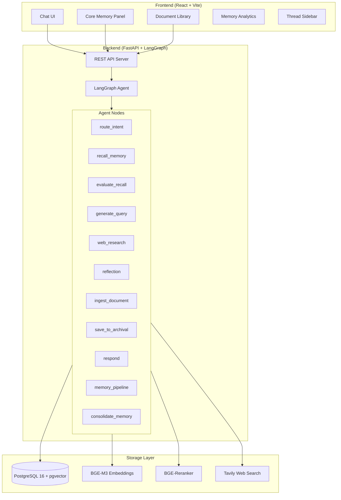
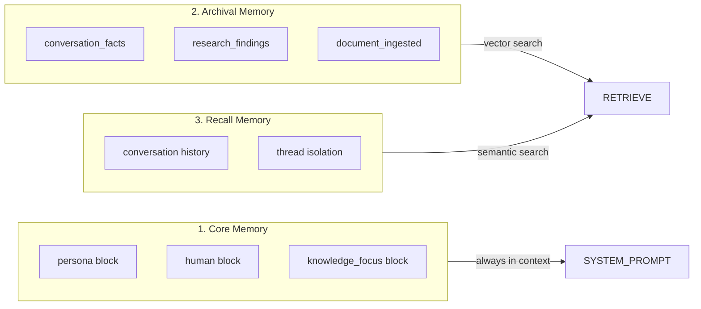

# Architecture Overview

Knowledge Agent is a personal knowledge agent with persistent memory, built on a three-tier memory architecture and LangGraph agent framework.

## System Architecture

## Three-Tier Memory Architecture

### Layer 1: Core Memory

Always present in the system prompt. Contains editable blocks:

| Block | Purpose | Editable |
|-------|---------|----------|
| `persona` | Agent personality and role definition | Yes |
| `human` | Information about the current user | Yes |
| `knowledge_focus` | Current research topics and interests | Yes |

Managed via LangChain tools: `core_memory_replace`, `core_memory_insert`.

### Layer 2: Archival Memory

Long-term semantic storage in PostgreSQL + pgvector. Stores:

- **conversation_facts**: Facts extracted from conversations via the memory pipeline
- **research_findings**: Summaries of web research results
- **document_ingested**: Chunks from ingested documents (URL, PDF, text)

Retrieved via hybrid search: vector similarity + BM25 keyword match, with optional cross-encoder re-ranking and MMR diversity.

### Layer 3: Recall Memory

Conversation history with semantic search capability. Each thread is isolated by `thread_id`. Used for referencing previous conversations.

## Technology Stack

| Component | Technology | Purpose |
|-----------|-----------|---------|
| Agent Framework | LangGraph | State machine orchestration |
| LLM | Configurable (default: gpt-4o-mini) | Reasoning and generation |
| Embeddings | BAAI/bge-m3 (1024-dim, local) | Semantic search vectors |
| Reranker | BAAI/bge-reranker-v2-m3 (local) | Cross-encoder re-ranking |
| Database | PostgreSQL 16 + pgvector | Vector storage + BM25 |
| Web Search | Tavily API | Research augmentation |
| Backend | FastAPI + Uvicorn | REST API + WebSocket |
| Frontend | React + Vite + shadcn/ui | Chat interface |

## Key Design Principles

1. **Memory-first**: Every interaction feeds into the memory system. Conversations are automatically analyzed for memorable facts.
2. **Proactive recall**: At conversation start, recent memories are pushed into context without explicit queries.
3. **Selective capture**: Not everything is worth remembering. A judgment step filters noise before extraction.
4. **Conflict resolution**: New facts are checked against existing memories. Conflicts trigger LLM-assisted merge or human review.
5. **Thread isolation**: Each conversation thread has independent recall memory, preventing cross-contamination.
