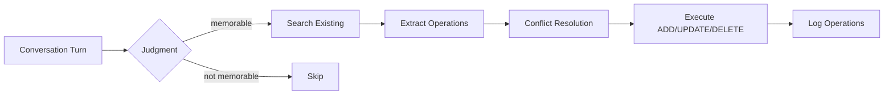

# Module: Memory Pipeline

**Source**: `backend/src/agent/nodes/memory_pipeline.py`

Implements the mem0-style memory extraction and consolidation pipeline on top of the three-layer architecture.

## Pipeline Overview

## Nodes

### `memory_pipeline(state, config) -> dict`

Runs after every conversation turn. The main selective memory capture pipeline.

**Steps**:
1. **Message summarization**: If conversation exceeds 30 messages, summarize older messages to prevent context overflow
2. **Judgment**: `MEMORY_JUDGMENT_PROMPT` determines if the turn is worth remembering
3. **Search existing**: Find similar existing memories for context
4. **Extraction**: `SELECTIVE_EXTRACTION_PROMPT` extracts ADD/UPDATE/DELETE operations
5. **Conflict resolution**: Check ADD operations against existing memories
6. **Execute operations**: Store/update/delete in archival memory

**Output**: `{turn_count: int, pipeline_facts: [...], memory_operations: [...]}`

### `consolidate_memory(state, config) -> dict`

Periodic batch consolidation triggered every N turns (default: 10).

**Purpose**: Merge duplicate facts, clean up stale entries, optimize memory quality.

## Key Functions

### `_resolve_conflicts(operations, existing, llm, threshold) -> list`

Checks ADD operations against existing memories for conflicts:

1. Compare new fact text against existing memory content
2. If word overlap suggests similarity, use `FACT_CONFLICT_PROMPT` to decide:
   - **update**: Merge new fact with existing (LLM generates merged text)
   - **skip**: Existing memory already covers this
3. Low-confidence decisions (< threshold) are queued for human review via `queue_conflict_review()`

### `summarize_old_messages(messages, llm, keep_recent) -> list`

When conversation exceeds `SUMMARIZE_THRESHOLD` (30 messages):
- Keeps the most recent 10 messages intact
- Summarizes all older messages into a single `[Conversation Summary]` message
- Prevents context window overflow in long conversations

## Memory Operations

| Operation | ID Format | Behavior |
|-----------|-----------|----------|
| ADD | `new_0`, `new_1`, ... | Create new archival entry |
| UPDATE | Existing UUID | Update content + metadata |
| DELETE | Existing UUID | Mark as deleted |

## Structured Extraction

When `structured_extraction` is enabled, each extracted memory includes:
- **entities**: `[{name, type}]` where type is person/place/org/event/date/project
- **temporal**: `{reference, absolute}` with original time expression and normalized date

This metadata enables supplementary search paths (`search_by_entity`, `search_by_temporal`).
