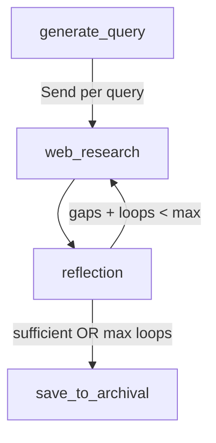

# Module: Researcher

**Source**: `backend/src/agent/nodes/researcher.py`

Handles web research augmentation: query generation, web search, and research reflection.

## Nodes

### `generate_query(state, config) -> dict`

Generates diverse search queries from the user's message.

**Input**: User message from conversation
**Output**: `{search_query: [str], research_loop_count: 0}`

Uses `QUERY_WRITER_PROMPT` to generate N queries (default: 3) that approach the topic from different angles.

### `web_research(state, config) -> dict`

Performs web search for a single query and summarizes results.

**Flow**:
1. Call Tavily API with the search query
2. Collect up to 5 results with titles, URLs, snippets
3. Summarize findings using `WEB_SEARCHER_PROMPT`

**Input**: `{search_query: str, id: str}` (from Send)
**Output**: `{web_research_result: [str], sources_gathered: [...]}`

**Note**: This node is executed in parallel via LangGraph's `Send` mechanism. Each query gets its own instance.

### `reflection(state, config) -> dict`

Evaluates whether gathered research is sufficient.

**Logic**:
1. Analyze all research summaries using `REFLECTION_PROMPT`
2. Determine if information is sufficient to answer the original question
3. If gaps exist, generate follow-up queries

**Output**: `{is_sufficient: bool, knowledge_gap: str, follow_up_queries: [str]}`

## Research Loop



- Max loops: configurable (default: 2)
- Follow-up queries from reflection trigger additional web_research via Send
- Total LLM calls per research cycle: N queries + N summaries + 1 reflection + N follow-ups

## Tavily Integration

```python
POST https://api.tavily.com/search
{
    "api_key": "...",
    "query": "...",
    "max_results": 5,
    "search_depth": "advanced"
}
```

Requires `TAVILY_API_KEY` environment variable. If missing, returns graceful fallback message.
