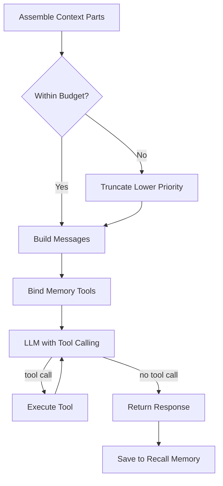

# Module: Responder

**Source**: `backend/src/agent/nodes/responder.py`

Generates the final response to the user, incorporating all gathered context (memory, research, core memory).

## Node

### `respond(state, config) -> dict`

Generates the assistant's response using all available context.

**Context Assembly** (priority order):
1. **Core Memory**: persona, human, knowledge_focus blocks (always included)
2. **Archival Results**: Retrieved from archival memory search
3. **Recall Results**: Retrieved from conversation history search
4. **Web Research**: Summaries from research loop
5. **Ingest Result**: Document ingestion feedback (if applicable)

**Context Budget Management**:
- Total budget: 120,000 tokens (estimated)
- Reserved: 10,000 tokens (for system prompt + tools + response)
- Available: ~110,000 tokens for context
- Truncation priority: web research first, then recall, then archival, then core memory

**Tool Execution Loop**:
- Max 5 tool rounds per response
- Tools available: `core_memory_replace`, `core_memory_insert`, `archival_memory_search`, `archival_memory_save`, `ingest_document`
- Agent can update core memory before composing response

**Output**: `{messages: [AIMessage]}`

## Response Generation Flow

## Key Design Decisions

1. **Context budget estimation**: Uses character-based estimation (4 chars/token) rather than tokenizer, for speed
2. **Priority-based truncation**: Core memory is never truncated; web research is truncated first
3. **Tool binding**: Memory tools are bound per-response, allowing the agent to update core memory inline
4. **Recall persistence**: Both user and assistant messages are saved to recall memory after response
