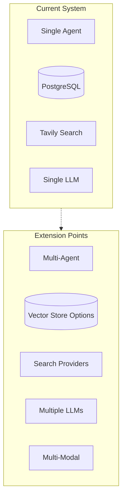

# Roadmap: Future Extensibility

This document outlines planned improvements and extension points for the Knowledge Agent.

## Current Architecture Extension Points

## Priority 1: Near-Term Improvements

### 1.1 Multi-Modal Input Support

**Current**: Text-only input
**Target**: Image, audio, video ingestion

- Add image extraction (OCR + vision model description)
- Audio transcription (Whisper)
- Video keyframe extraction + transcription
- Store multi-modal content as text descriptions with metadata

### 1.2 Pluggable Search Providers

**Current**: Tavily API only
**Target**: Configurable search backend

| Provider | Type | Status |
|----------|------|--------|
| Tavily | API | Implemented |
| SearXNG | Self-hosted | Planned |
| Brave Search | API | Planned |
| Google Custom Search | API | Planned |
| DuckDuckGo | Scraping | Planned |

Implementation: `SearchProvider` interface with `search(query, max_results) -> list[dict]`

### 1.3 Pluggable LLM Providers

**Current**: Single LLM (default: gpt-4o-mini)
**Target**: Model per task

| Task | Current | Target |
|------|---------|--------|
| Intent routing | gpt-4o-mini | Fast model (gpt-4o-mini) |
| Memory judgment | gpt-4o-mini | Fast model |
| Memory extraction | gpt-4o-mini | Capable model (gpt-4o) |
| Response generation | gpt-4o-mini | User-configurable |
| Research summarization | gpt-4o-mini | Fast model |

### 1.4 Embedding Model Flexibility

**Current**: BGE-M3 (local, 1024-dim)
**Target**: Configurable embedding backend

- Support remote embedding APIs (OpenAI, Cohere, Jina)
- Auto-detect dimensionality from model
- Migration script for re-embedding existing data

## Priority 2: Medium-Term Features

### 2.1 Multi-Agent Collaboration

**Current**: Single agent handles all tasks
**Target**: Specialized agent roles (inspired by jcode swarm)

| Role | Responsibility |
|------|---------------|
| Coordinator | Intent routing, task delegation |
| Researcher | Web search, source evaluation |
| Writer | Response synthesis, formatting |
| Memory Manager | Fact extraction, consolidation |
| Critic | Answer quality review |

### 2.2 Knowledge Graph Integration

**Current**: Flat vector storage
**Target**: Entity-relation graph overlay

- Extract entities and relationships from stored facts
- Build a local knowledge graph (e.g., NetworkX or Neo4j)
- Use graph traversal for multi-hop reasoning
- Visualize knowledge graph in frontend

### 2.3 Advanced Memory Consolidation

**Current**: Periodic batch consolidation
**Target**: Continuous, intelligent consolidation

- Embedding-based clustering for topic grouping
- Automatic fact summarization (compress N facts into 1 summary)
- Memory aging: decay scores for old, unretrieved memories
- Importance scoring: track how often each memory is retrieved

### 2.4 Streaming Responses

**Current**: Full response generation
**Target**: Token-by-token streaming

- Backend: LangGraph streaming support
- Frontend: Progressive rendering
- Tool call status: Show which tools are being called in real-time

## Priority 3: Long-Term Vision

### 3.1 Distributed Vector Storage

**Current**: Single PostgreSQL instance
**Target**: Scalable vector database

Options:
- Milvus: Purpose-built vector DB, horizontal scaling
- Qdrant: Rust-based, high performance
- Weaviate: GraphQL API, multi-tenancy

### 3.2 Multi-User Support

**Current**: Single-user system
**Target**: Multi-user with isolation

- User authentication (OAuth2)
- Per-user memory isolation
- Shared knowledge bases (team/org level)
- Permission model for memory access

### 3.3 Plugin System

**Current**: Monolithic codebase
**Target**: Extensible plugin architecture

- Ingestion plugins: Custom document processors
- Search plugins: Custom retrieval strategies
- Memory plugins: Custom consolidation algorithms
- Tool plugins: Custom agent tools

### 3.4 Evaluation & Observability

**Current**: Manual testing with scripts
**Target**: Automated evaluation pipeline

- LLM-as-judge for response quality
- Memory recall precision/recall metrics
- Latency dashboards (P50, P95, P99)
- Cost tracking per query
- LangSmith/Langfuse integration

## Extension Points Summary

| Component | Interface | Extension |
|-----------|-----------|-----------|
| Search | `SearchProvider.search()` | Add new search backends |
| Embedding | `Embeddings` (LangChain) | Swap embedding models |
| Reranker | `reranker.rerank()` | Custom reranking strategies |
| Ingestion | `ingestion.extract_*()` | New document types |
| LLM | `get_llm()` | Different models per task |
| Storage | `storage.get_conn()` | Different vector databases |
| Tools | `@tool` decorator | New agent capabilities |
